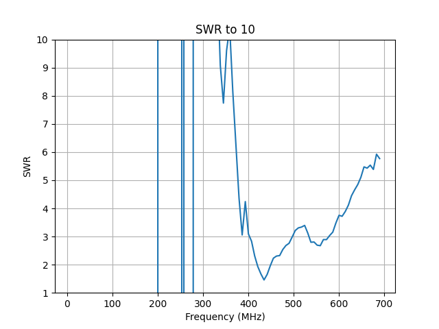
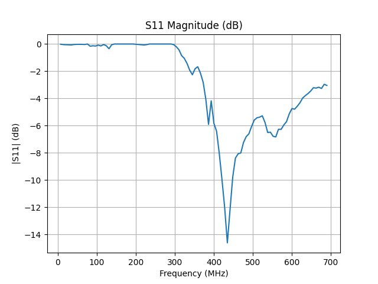
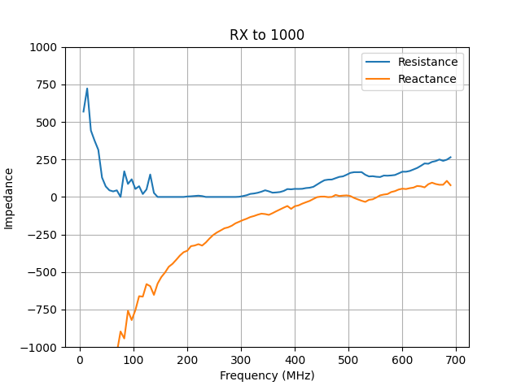
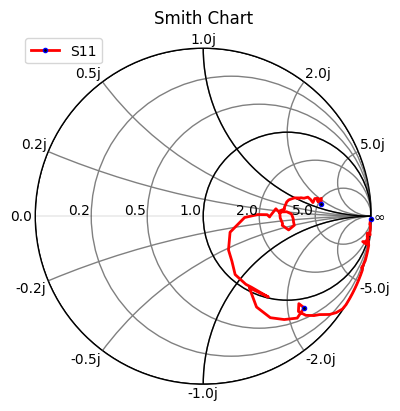

# RigExpert Match CLI and TT-Plot, with AI Agent Integration

Video:

[](https://youtube.com/shorts/ghPHNbW07E8)

A set of Python scripts for controlling the RigExpert Match Antenna Analyzer and plotting Touchstone data, with AI agent integration in mind.

## Scripts

### 1. match-cli.py

A command-line interface for controlling the RigExpert Match Antenna Analyzer.

#### Features

- **Read Data**: Read R and X values from the analyzer and output in Touchstone format.
- **Status Check**: Check the connection status of the analyzer.
- **Trace Mode**: Enable trace mode to output raw data from the analyzer for debugging.
- **Frequency Input**: Support for frequency input in kHz or MHz with appropriate suffixes.
- **Timestamp**: Include timestamp in the Touchstone file header.

#### Installation

##### Prerequisites

- Python 3.x
- `hid` library for HID device communication
- `matplotlib` for plotting
- `numpy` for numerical operations
- `skrf` for Smith chart plotting

##### Install Dependencies

```bash
pip install hidapi matplotlib numpy scikit-rf
```

#### Usage

##### Display Help

```bash
python3 match-cli.py -h
```

##### Check Status

```bash
python3 match-cli.py status
```

##### Read Data

```bash
python3 match-cli.py read --center 100MHz --range 200MHz --points 100
```

By default, Touchstone data is written to stdout unless `--output` is provided.

##### Read Data to a File

```bash
python3 match-cli.py read --center 100MHz --range 200MHz --points 100 --output data.s1p
```

##### Read Data with Trace

```bash
python3 match-cli.py read --center 100MHz --range 200MHz --points 100 --trace
```

#### Examples

##### Example Output

```
! Touchstone file generated by match-cli.py on 2023-11-15 14:30:45
# MHz Z RI R 50
100.0 49.99 0.04
100.0 50.03 0.07
100.0 50.03 0.03
...
```

##### Trace Mode Output

```
Command sent: FQ100000000
Command sent: SW200000000
Command sent: FRX10
! Touchstone file generated by match-cli.py on 2023-11-15 14:30:45
# MHz Z RI R 50
Raw data: OK
Raw data: OK
Raw data: 0.000000,49.99, 0.04
100.0 49.99 0.04
Raw data: 20.000000,50.03, 0.07
100.0 50.03 0.07
...
```

### 2. tt-plot.py

A script for plotting Touchstone data from stdin or a file.

#### Features

- **Input Handling**: Parse Touchstone data from stdin or a file with `.s1p` extension.
- **Format Detection**: Automatically detect the Touchstone format (S,RI, S,MA, S,DB, or Z,RI).
- **Plot Generation**: Generate plots based on the specified type (SWR to 10, SWR to 2, S11, RX to 1000, RX to 100, Smith chart).
- **Output**: Save the resulting plot to a file specified by the user.
- **Help Display**: Display help when run without parameters or with `-h` or `--help`.

#### Installation

##### Prerequisites

- Python 3.x
- `matplotlib` for plotting
- `numpy` for numerical operations
- `skrf` for Smith chart plotting

##### Install Dependencies

```bash
pip install matplotlib numpy scikit-rf
```

#### Usage

##### Display Help

```bash
python3 tt-plot.py -h
```

##### Plot SWR to 10

```bash
python3 tt-plot.py --type swr10 --output plot.png < data.s1p
```

##### Plot Smith Chart

```bash
python3 tt-plot.py --type smith --output smith_chart.png data.s1p
```

##### Plot RX to 100

```bash
python3 tt-plot.py --type rx100 --output rx_plot.png data.s1p
```

#### Examples

##### Example Output

```
Plot saved to plot.png
```

##### Example Charts

###### SWR to 10



###### S11



###### RX to 1000



###### Smith Chart



##### Supported Formats

- **S,RI**: Real and imaginary parts of the S-parameter.
- **S,MA**: Magnitude and angle of the S-parameter.
- **S,DB**: Magnitude in decibels (dB) of the S-parameter.
- **Z,RI**: Real and imaginary parts of the impedance (Z).

## License

This project is licensed under the MIT License. See the [LICENSE](LICENSE) file for details.

## Acknowledgments

This code was generated with the help of an AI model, Mistral Vibe.

## Testing

The scripts have been tested on Raspberry Pi 4 and with OpenClaw AI agent.

## AI Agent Integration

This CLI is structured to be easy to call from an external AI agent. A typical agent flow is: detect the analyzer, run a scan with `match-cli.py read`, then hand the resulting `.s1p` data to `tt-plot.py` for visualization, and finally present the plots or computed metrics back to the user.

To integrate with an AI agent:
- Install the Python dependencies listed above on the agent host.
- Copy `match-cli.py` and `tt-plot.py` into the agent’s workspace/tools directory.
- Copy the '/skills/re-match/' folder to the '/skills' folder of you AI agent. 
- Ensure the agent’s runtime has access to the USB HID device (udev rules below).
- Call the scripts as subprocesses and pass the resulting `.s1p` data to downstream reasoning or visualization steps.

## Udev Rules

On some systems (notably Volumio/RPI), `match-cli.py` can see the device only after permissions are granted on the USB device node. The rule below sets group access on the USB device so non-root users can open it.

1. Create `/etc/udev/rules.d/99-rigexpert-usb.rules` with the following content:

```
SUBSYSTEM=="usb", DEVTYPE=="usb_device", ATTR{idVendor}=="0483", ATTR{idProduct}=="a1de", RUN+="/bin/chgrp plugdev /dev/bus/usb/%E{BUSNUM}/%E{DEVNUM}", RUN+="/bin/chmod 0660 /dev/bus/usb/%E{BUSNUM}/%E{DEVNUM}"
```

2. Ensure the group exists and add your user:

```bash
sudo groupadd -f plugdev
sudo usermod -aG plugdev $USER
```

3. Reload the rules and replug the device:

```bash
sudo udevadm control --reload-rules
sudo udevadm trigger --subsystem-match=usb --action=add
```

4. Re-login (or run `newgrp plugdev`) and verify:

```bash
ls -l /dev/bus/usb/*/*
python3 match-cli.py status
```

Notes:
- If you still see `open failed`, check the permissions on `/dev/bus/usb/<bus>/<dev>` and ensure it is `root:plugdev` with `0660`.
- A `hidraw` rule alone may not be sufficient on all distros; the USB node permissions are the reliable fix.

## Contributing

Contributions are welcome! Please open an issue or submit a pull request for any improvements or bug fixes.

## Support

For support, please contact the project maintainers or open an issue on the project repository.
